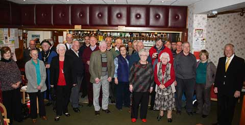
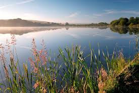
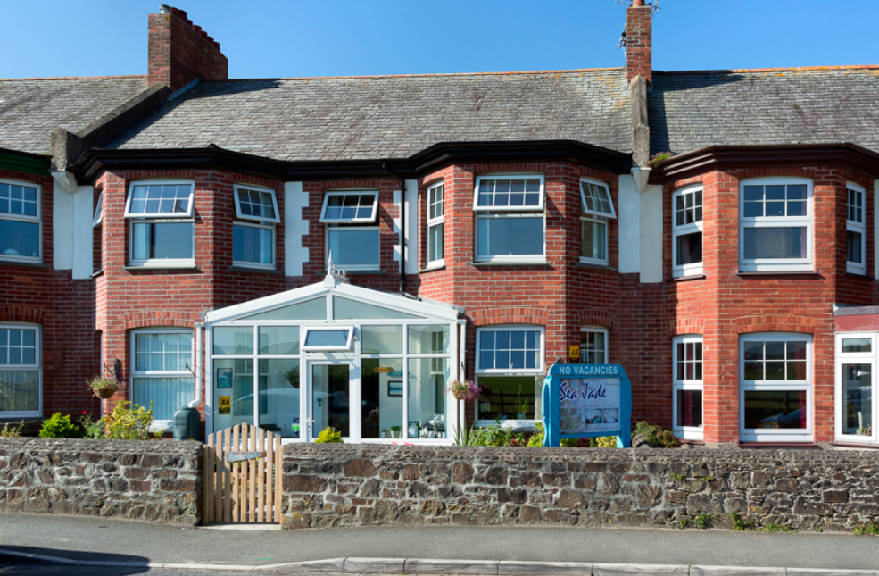
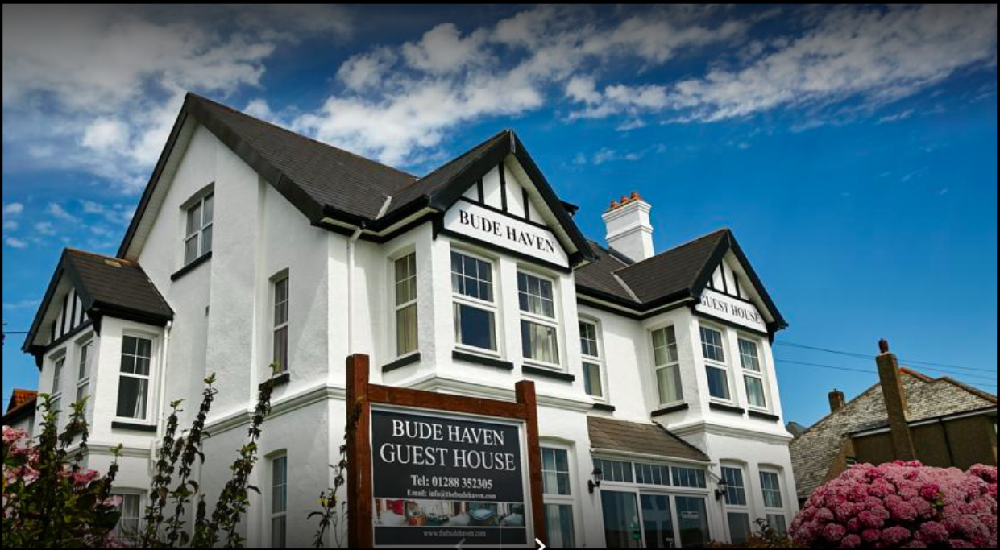

```{r setup, include=FALSE}
knitr::opts_chunk$set(echo = TRUE)
library(ggmap)
library(tidyverse)
```


### Add after fork

# add yellow point: Bude Social Club
# add black point: Maer Lake
# add pink point: Sea Jade Guest House
# add grey point: The Bude Haven Guesthouse

```{r message=FALSE}
roadmap <- get_map('Bude', zoom = 14)
ggmap(roadmap) +
  geom_point(
    aes(x = -4.551349 , y = 50.83054),
    color = "blue", size = 2) +
  geom_point(
    aes(x = -4.553962 , y = 50.83587),
    color = "green", size = 2) +
  geom_point(
    aes(x =  -4.552814 , y = 50.83347),
    color = "red", size = 2) +
  geom_point(
    aes(x = -4.543023, y = 50.83007),
    color = "purple", size = 2) + 
  geom_point(
    aes(x = -4.5510, y = 50.8322),
    color = "orange", size = 2) +
  geom_point(
    aes(x = -88.45097, y = 42.58492),
    color = "black", size = 2) +
  geom_point(
    aes(x = -4.545369, y = 50.82959),
    color = "yellow", size = 2) +
  geom_point(
    aes(x = -4.547, y =50.838681),
    color = "black", size = 2)+
  geom_point(
    aes(x = -4.548, y = 50.8303),
    color = "pink", size = 2)+
  geom_point(
    aes(x = -4.5435, y = 50.8317),
    color = "grey", size = 2)+
  geom_path(aes(x = lon, y = lat), color = "blue", size = 1, data = r, lineend = "round")
dev.copy(png,'roadmap.png')
dev.off()


watermap <- get_map('Bude', zoom = 14, maptype = 'watercolor')
ggmap(watermap) +
  geom_point(
    aes(x = -4.551349 , y = 50.83054),
    color = "blue", size = 2) +
  geom_point(
    aes(x = -4.553962 , y = 50.83587),
    color = "green", size = 2) +
  geom_point(
    aes(x =  -4.552814 , y = 50.83347),
    color = "red", size = 2) +
  geom_point(
    aes(x = -4.543023, y = 50.83007),
    color = "purple", size = 2) +
  geom_point(
    aes(x = -4.5510, y = 50.8322),
    color = "orange", size = 2) +
  geom_point(
    aes(x = -88.45097, y = 42.58492),
    color = "black", size = 2) +
  geom_point(
    aes(x = -4.545369, y = 50.82959),
    color = "yellow", size = 2) +
  geom_point(
    aes(x = -4.547, y =50.838681),
    color = "black", size = 2)+
  geom_point(
    aes(x = -4.548, y = 50.8303),
    color = "pink", size = 2)+
  geom_point(
    aes(x = -4.5435, y = 50.8317),
    color = "grey", size = 2)+
  geom_path(aes(x = lon, y = lat), color = "red", size = 1, data = r, lineend = "round")
dev.copy(png,'watermap.png')
dev.off()
```

#Images





